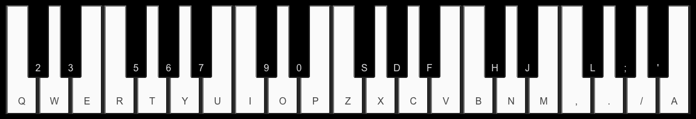

# piano
Piano Keyboard  

# Getting Started

**Build Yourself!**   
**$ npx create-react-app piano-hooks**  
**$ npm i soundfont-player**  
(build yourself)   
OR   
**Use Mine!**   
**$ git clone https://github.com/jacksonmccluskey/piano.js.git** 
**$ cd piano-hooks** 
**$ npm install** 
**$ npm start** 
  
